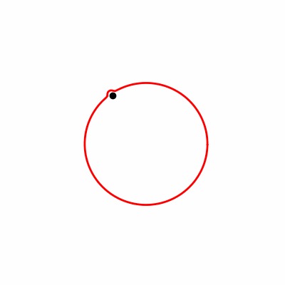

# 1D CANN

## 方法简介

本章节的分析方法主要用于研究 **单环连续吸引子神经网络（1D CANN）** 上的神经群体活动随时间的动态变化，核心目标是追踪神经活动在环形网络上的“bump”位置及其演化特征。

本分析基于 **真实实验数据**，使用的是 **果蝇（Drosophila）中心脑** 经过预处理得到的 **16 个 ROI 的荧光强度时间序列**，  
通过对这些数据进行降噪、平滑和可视化处理，可观察神经群体在二维环面上的活动轨迹。

> **数据来源**：  
> *Kim et al., "Ring attractor dynamics in the Drosophila central brain", Science, 2017*  
> DOI: [10.1126/science.aal4835](https://doi.org/10.1126/science.aal4835)


本章方法的核心背景与数据特点如下：

1. **数据来源与预处理**  
   - 数据来源于果蝇中央复合体（Central Complex）中的 **EPG 区域**，记录的是钙成像信号。  
   - 经过预处理后，将荧光强度数据划分为若干 **ROI（Region of Interest）**，每个 ROI 对应一条随时间变化的荧光强度曲线。

2. **分析目标**  
   - 从这些 ROI 荧光信号中提取环形神经网络上的活动峰（bump）的：
     - **位置（center）**
     - **高度（amplitude）**
     - **宽度（width）**
   - 这些参数随时间的变化可反映神经 bump 在环形网络中的动态移动。

3. **功能模块**  
   - **MCMC 拟合 bump 模型**：  
     使用 `bump_fits` 函数对 ROI 数据进行贝叶斯采样与拟合，输出 `bump_fit.npz`，记录 bump 的位置、高度、宽度随时间的变化。  
   - **可视化 bump 轨迹**：  
     提供示例函数将拟合结果在环形轨道上进行可视化，展示 bump 随时间的运动轨迹，可生成静态图或动画（GIF）。

通过该方法，我们可以清晰地观察果蝇 EPG 环路中神经活动 bump 的时序演化，为分析 1D CANN 的动力学提供直接证据。

---

## 主要函数：bump_fits

功能：
- 对给定的 ROI 数据进行 bump 拟合；
- 使用 MCMC 算法探索最优的 bump 参数；
- 输出 bump_fit.npz，包含 [center, height, width] 随时间变化的序列。

---

## 可视化示例
```python
import numpy as np
from utils1d import *

# 加载数据
print("加载数据...")
data = np.loadtxt("bump_data.txt")
nbt = data.shape[0]  # 获取帧数

print("数据预处理...")
flat_data = data.flatten()
median = median_via_quickselect(flat_data) * 0.7
print(f"计算中位数: {median:.4f} (使用快速选择算法)")

normed = (flat_data / median) - 1.0
trial = {"nbt": nbt, "data": normed}

# 运行MCMC
print(f"开始MCMC采样，共{nbt}帧，{NB_MOVES}次迭代...")
bumps = mcmc(trial)

# 保存结果
print("保存结果...")
save_outputs(bumps, trial)
print("结果已保存为:")
print(f"  - {output_prefix}-fits.dat")
print(f"  - {output_prefix}-nbump.dat")
print(f"  - {output_prefix}-centrbump.dat")
```
### 输出结果可视化

下图展示了 `bump_fits` 生成的 **bump 三个参数（中心、峰值、高度）随时间变化**的可视化示例：

**图5. bump 参数动态变化示例**



