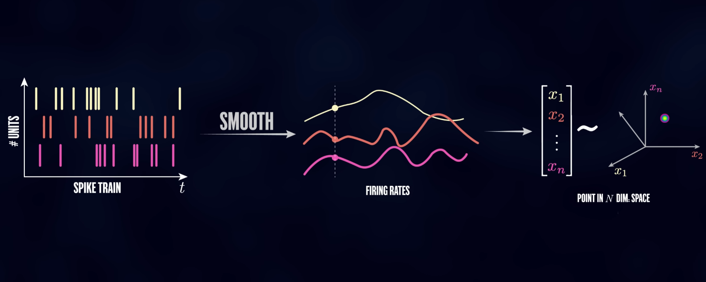
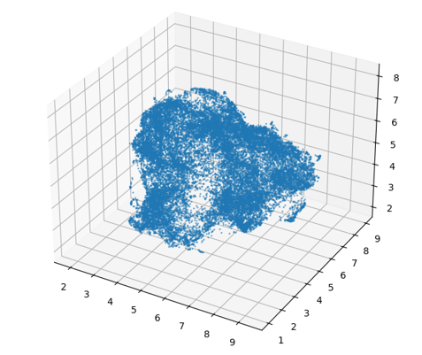
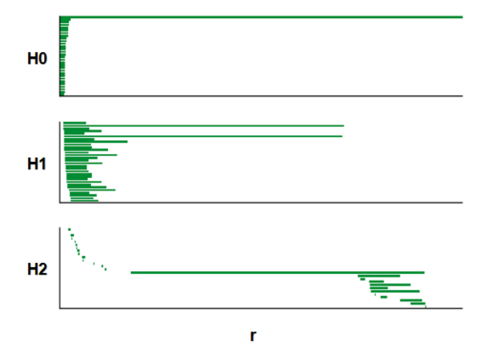

# 2D CANN

## 方法简介

本章的分析重点在于探索真实生物脑中神经群体活动所呈现的结构特征，  
特别是验证这些活动是否存在符合二维连续吸引子神经网络（2D CANN）动力学的低维拓扑结构。  
通过 **拓扑数据分析（Topological Data Analysis, TDA）**，我们能够识别神经群体活动中可能存在的低维流形结构，例如环面（torus），  
并进一步用可视化方法进行展示。

> **说明**：本章节所有示意图均基于真实实验数据，数据来源于下列论文：  
> *Gardner et al., "Toroidal topology of population activity in grid cells", Nature, 2021*  
> DOI: [10.1038/s41586-021-04268-7](https://doi.org/10.1038/s41586-021-04268-7)


本章方法具有以下特点：

1. **面向真实神经数据**  
   - 输入数据为从小鼠内嗅皮层（Medial Entorhinal Cortex, MEC）记录的**grid cell** 神经元放电序列（spike train）。  
   - 数据经过时间对齐和预处理后，可直接作为高维点云用于后续分析。

2. **功能模块清晰**  
   - **降维与可视化**：  
     使用 `get_spikes` 将 spike train 转换为平滑高维点云，并可选择 PCA/UMAP 等方法降维，直观展示神经活动在低维空间的轨迹。  
   - **拓扑数据分析（TDA）**：  
     使用 `TDAvis` 对高维点云进行持久同调分析（Persistent Homology），输出 H0/H1/H2 的 barcode 图，并可结合 shuffle 检验结构显著性。
   - **环面 bump 可视化**：  
     使用 `bump_fit` 将神经群体活动映射到二维环面 (torus)，生成随时间演化的 **bump 动态轨迹** 或 3D 环面 GIF，直观展示连续吸引子神经网络的动力学特征。

流程：
1. 将实验 spike train 数据转换为高维点云；
2. 对高维点云进行拓扑数据分析（TDA）；
3. 绘制持久同调条形码图（barcode）。

---

## 函数 1：get_spikes

**功能**  
- 将实验数据的 spike train 转化为平滑高维点云；  
- 输出高维点云矩阵（`n_points × n_neurons`），可用于后续降维或拓扑分析。

---

### 1. 示意图

下图展示了 `get_spikes` 的核心思想：从 spike train 出发，经过平滑得到各神经元的瞬时放电率（firing rates），并将每个时间点对应的 firing rates 组合为高维点云。

**图1. Spike train → 高维点云示意**  



---

### 2. 真实数据示例

以小鼠在 open field 实验中的 spike train 数据为例，通过 `get_spikes` 转换为高维点云后，用 **UMAP** 将其降至三维，得到如下结果。

**图2. UMAP 三维投影可视化**



---

### 3. 示例代码

```python
import numpy as np
import matplotlib.pyplot as plt
import umap
from mpl_toolkits.mplot3d import Axes3D
from brainpy import get_spikes  

# Step 1: 从 npz 文件加载 spike train 并转换为高维点云
sspikes = get_spikes(npz_path, speed0=False)

# Step 2: UMAP 降维至 3D
reducer = umap.UMAP(
    n_neighbors=15,
    min_dist=0.1,
    n_components=3,
    metric='euclidean',
    random_state=42
)
sspikes = sspikes[::5]  # 下采样以加快可视化

embedding = reducer.fit_transform(sspikes)

# Step 3: 3D Visualization
fig = plt.figure(figsize=(8, 6))
ax = fig.add_subplot(111, projection='3d')
ax.scatter(embedding[:, 0], embedding[:, 1], embedding[:, 2], s=1, alpha=0.5)
ax.set_title("UMAP projection (3D)")
plt.tight_layout()
plt.show()

```

---

## 函数 2：`TDA_vis`

### 功能
- `TDA_vis` 用于对高维神经元点云进行 **拓扑数据分析 (TDA)**；
- 本方法采用 **持续同调 (Persistent Homology)**，用于捕捉点云在不同尺度下的拓扑特征，如连通分支 (H0)、环路 (H1) 和空腔 (H2)；
- 输出可视化图包括 **持久条形图 (barcode)** 或 **持久图 (persistence diagram)**，用于观察环面或环结构等神经动力学特征。

---

### 1. 分析流程
1. 从 `get_spikes` 得到的高维点云开始；
2. 构建 **Vietoris-Rips 复形**；
3. 计算 **持续同调** 并生成持久图；
4. 输出结果可帮助验证神经活动是否形成环或环面等低维流形；

---

### 2. 示例代码

```python
from brainpy import TDAvis
persistence = TDAvis(npz_path,
           dim=6,
           num_times=5,
           speed0 = True,
           active_times=15000,
           k=1000,
           n_points=1200,
           metric='cosine',
           nbs=800,
           maxdim=1,
           coeff=47,
           bRoll=False,
           s=50,
           show=True)
```
### 3. 输出示例

运行上述代码后，将得到 **神经点云的持久图**。  
在持久图中：

- **H0** 点表示连通分支的出现与消失；
- **H1** 点表示环路（如一维环或环面）；
- **H2** 点表示空腔（如环面内部的孔洞）。

**图3. 持久同调可视化结果**



---

## 函数 3：`bump_fit`

### 功能
- 对群体神经活动进行 **bump 可视化**；
- 将 spike 数据投影到二维环面 (torus) 并进行平滑；
- 可生成 3D 环面上的 bump 动画，用于直观展示神经群体活动的 **连续吸引子动力学**。

---

### 1. 示意流程
1. 对 spike train 进行窗口切片；
2. 在环面坐标上统计群体活动强度；
3. 使用平滑函数 `smooth_tuning_map` 生成连续 bump；
4. 将结果映射到 3D 环面并生成 GIF。

本示例基于前一节的 `TDA_vis` 分析结果，利用 H1 的两条持久条形图 (barcode) 提供的环面拓扑信息，在环面上重建群体活动的 **bump 移动路径**，并进行可视化。


---

### 2. 示例代码

```python
from brainpy import bump_fit

bump_fit(
    spikes,
    coords,
    window_size=300,
    frame_step=5,
    n_frames=200,
    save_gif='torus_bump.gif'
)
```
### 3. 输出示例

运行上述代码后，将在 **3D 环面** 上生成随时间移动的 bump，可导出为 GIF 文件。

**图4. 群体神经活动在环面上的 bump 动态可视化**


